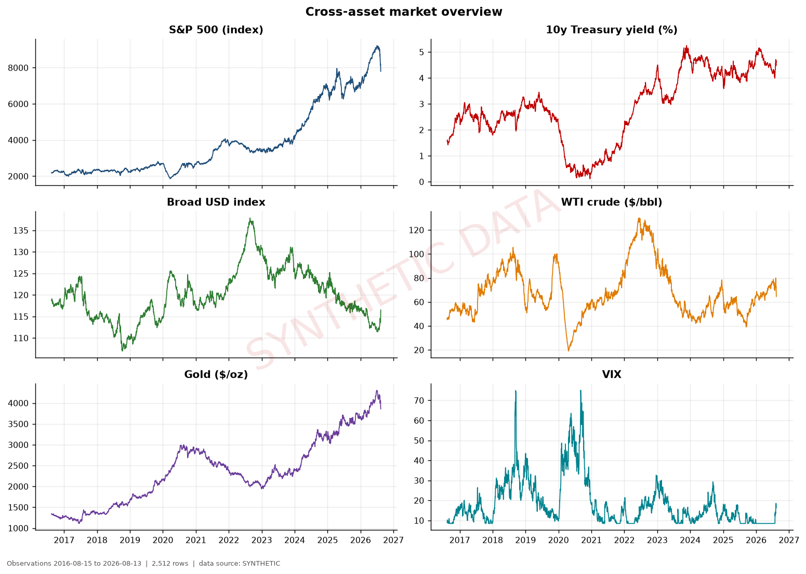
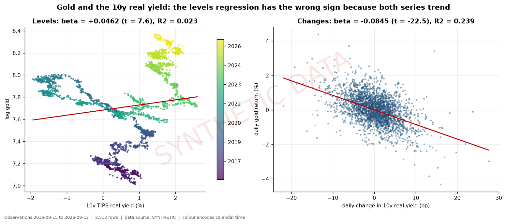
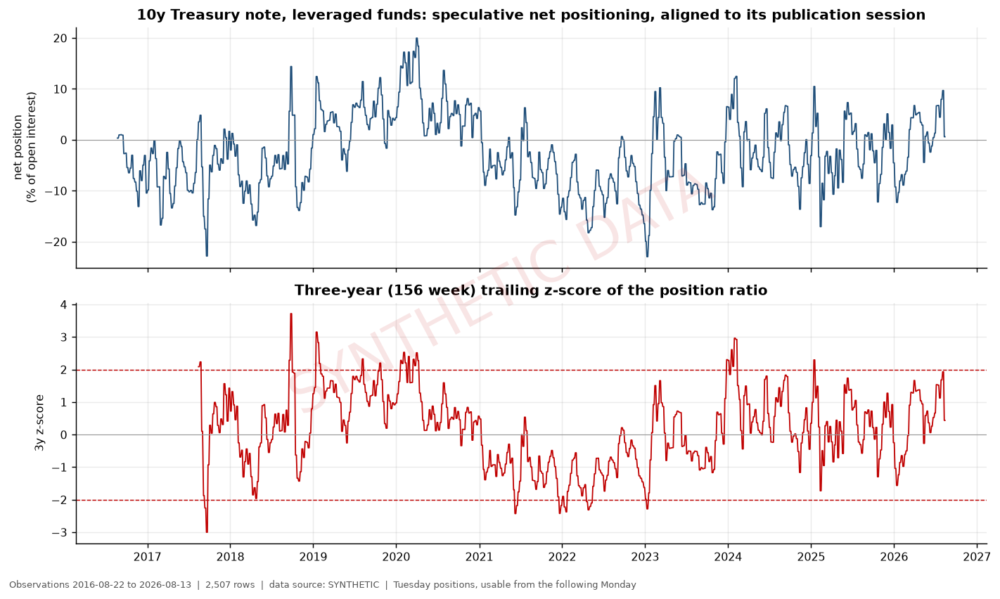
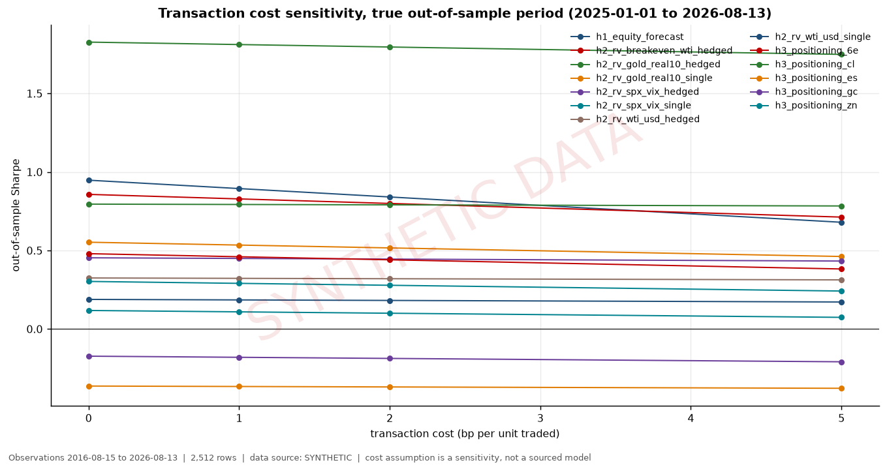
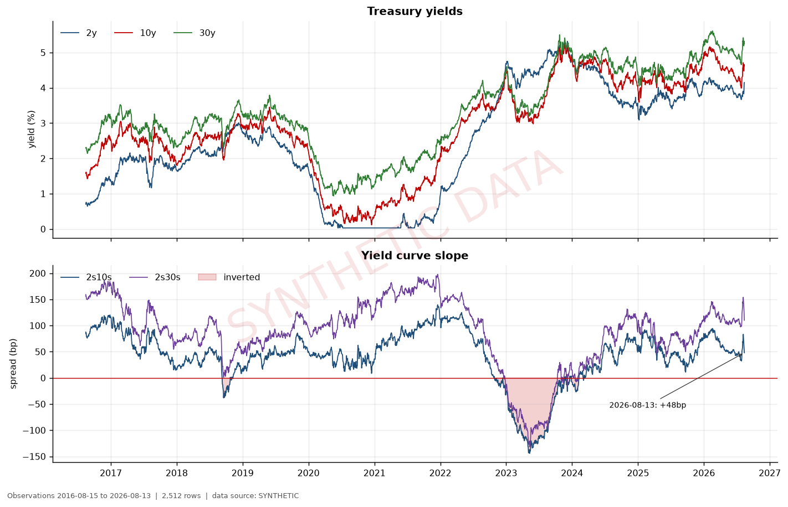

# Macro Markets Quantitative Research Platform

**A production-style research system for cross-asset macro and relative value.**
Python · pandas · NumPy · statsmodels · Excel · time series analysis

[](https://github.com/BruceMoseti/MacroMicro/actions/workflows/ci.yml)

Financial firms run on a specific kind of software: pipelines that pull messy market data
from several providers, reshape it correctly, and feed models whose answers move money. When
that software is subtly wrong, the model does not crash — it produces a confident, plausible,
wrong number. This project is a complete example of that kind of system, built to catch its
own mistakes.

It asks one question: **can interest rates, currencies, volatility, commodities, economic data
and derivatives positioning explain how markets move together, and can that be turned into a
usable signal?** Three ideas were written down in advance, tested against ten years of data,
and reported honestly — including the two that did not work.

---

## At a glance

| | |
|---|---|
| **What it does** | Ingests 5 datasets across 4 APIs, engineers 164 features, runs 3 research hypotheses, backtests 13 strategies, and publishes a 26-sheet Excel monitor, 17 charts and a 13-section research report |
| **Scale** | 5,107 lines of Python across 16 modules · 2,512 trading days · 23 market, macro and positioning series |
| **Correctness** | 96 automated tests · 55 data-integrity and leakage checks · pipeline exits non-zero on any critical failure |
| **Reproducibility** | A fresh clone regenerates every result in 18 seconds, verified in CI against the committed values to a numerical tolerance |
| **Domain bugs caught** | 8 documented failure modes that a naive implementation would ship silently (see below) |
| **Skills demonstrated** | Data engineering · time series statistics · testing & validation design · financial domain knowledge · technical writing |



---

## Why this is harder than it looks

A cross-asset research pipeline is deceptively difficult, because it is full of traps that do
not announce themselves. Below are eight real ones this system handles. Each was a decision I
had to make, and each is the kind of thing that separates working financial software from
software that merely runs.

| The trap | What happens if you miss it | How it's handled |
|---|---|---|
| **Oil traded at a negative price** | WTI printed **−\$37.63** on 2020-04-20. A percentage return needs a logarithm, which is undefined for a negative number, so the whole series silently fills with `NaN` | An explicit non-positive-price check fails the run rather than propagating nulls |
| **Positioning data is published 3 days late** | Government positioning reports describe **Tuesday** but are released **Friday afternoon**. Using Tuesday's data on Wednesday gives the model information nobody had | Every report is withheld until the trading session *after* its release — a 6-day lag, 7 across holidays |
| **Economic data gets revised** | Today's copy of 2019 inflation is not what 2019 actually saw. A backtest reading it is cheating | Full historical vintages are stored; each series is rebuilt *as it was known* on each date |
| **A standard regression is unsolvable** | The textbook equity/rates model includes three inputs where one is exactly the difference of the other two. The math has no unique answer, but the software returns numbers anyway | Rank is checked explicitly (4 columns, rank 3) and the failure is reported, then replaced with two valid formulations |
| **Two rising series look related when they aren't** | Gold vs. real interest rates gives a **positive** relationship in raw levels — the opposite of the truth — because both drifted upward for a decade | Every relationship is estimated both ways; the contradiction is surfaced, not buried |
| **A "win rate" that can't exceed 50%** | Counting flat days as losses caps the win rate at however often the strategy is invested, making a selective strategy look broken | Win rate is measured only over days the strategy holds risk |
| **Charging interest on money you aren't using** | Subtracting a cash rate on days with no position understates returns; over this period rates ranged from 0% to 5%+ | Financing applies only to positions actually held, and only where it economically should |
| **Position sizing that destroys your own metrics** | Resizing daily means the position changes every day, so "number of trades" and "turnover" become meaningless | Size is set when a trade opens and held for its life |

**The check I'm most pleased with** is the one that tests the other checks. Rather than
*claiming* no calculation peeks at future data, the system proves it: it multiplies the last 40
rows of input by 1.25 and requires every earlier result to be **bit-identical**. If any
calculation looked forward, earlier numbers would shift and the test fails. The test suite then
feeds it three deliberately broken calculations to confirm the check can actually fail — a
safety check that cannot fail is worse than none at all.

```python
# src/validation.py — leakage is proven, not asserted
baseline = transform(data)
perturbed_input.iloc[-40:] *= 1.25          # change only the future
perturbed = transform(perturbed_input)
assert (baseline[:-40] - perturbed[:-40]).abs().max() == 0.0
```

---

## Architecture

One pipeline, one command, one path through the system.

```
FRED · ALFRED · CFTC · Cboe          5 datasets across 4 external APIs
        |
        v
    raw layer            written once, never mutated  (audit trail)
        |
        v
   validation            55 checks · aborts on critical failure
        |
        v
  feature engine         164 features · publication-aware · trailing windows only
        |
        ├──────────────────┬──────────────────┐
        v                  v                  v
  H1 regressions    H2 relative value   H3 positioning
        └──────────────────┼──────────────────┘
                           v
                      backtester        one timing rule · cost grid · vol targeting
                           v
        Excel monitor · 17 charts · research report · interview sheet
```

| Module | Lines | Responsibility |
|---|---|---|
| `config.py` | 271 | Every date, series ID, split boundary and constant — defined exactly once |
| `synthetic.py` | 623 | Frozen seeded dataset so the system runs without network access |
| `data_loader.py` | 271 | Ingestion from 4 providers; normalises two different report schemas into one |
| `validation.py` | 335 | 55 integrity and leakage checks, including the perturbation test |
| `features.py` | 242 | Returns, volatility, z-scores, publication alignment, point-in-time economics |
| `regressions.py` | 247 | Regression with autocorrelation-robust errors, collinearity diagnostics |
| `relative_value.py` | 369 | Pair relationships, stationarity testing, hedged spread construction |
| `signals.py` | 309 | Signal construction and the declared candidate registry |
| `backtest.py` | 208 | Timing rule, costs, position sizing, split consistency |
| `metrics.py` | 140 | Performance statistics |
| `regimes.py` | 77 | Market condition classification |
| `charts.py` | 444 | 17 figures, each stamped with its date range and data source |
| `reporting.py` + `report_text.py` | 1,155 | Excel monitor and a report assembled from the computed tables |
| `pipeline.py` | 298 | Orchestration |

**Design decisions worth noting:**

- **One source of truth.** Every constant lives in `config.py`. Changing the research window is
  a one-line edit, not a search-and-replace across 16 files.
- **Raw data is immutable.** Downloads are written once and never modified, so any result can be
  traced back to the bytes that produced it — the same requirement a regulated firm has.
- **The report writes itself.** Every number in the 13-section research report is read from the
  computed tables rather than typed in, so the prose cannot drift out of sync with the results.
- **Failures are loud.** The pipeline returns a non-zero exit code if any critical check fails,
  so it is wired straight into CI: `.github/workflows/ci.yml` runs lint, the tests, the full
  pipeline, and a reproducibility assertion on every push.
- **Reproducibility is verified numerically, not byte-wise.** Within one environment the output
  is bit-identical. Across environments it is not, and that is expected rather than a defect:
  regression coefficients and matrix inversions go through BLAS, whose reduction order depends
  on the library build and the CPU, so two correct runs can differ in a float's last bits.
  `tools/check_reproducibility.py` therefore compares every number against the committed value
  within a tolerance and prints the largest difference it found, so genuine drift is visible
  instead of being absorbed. I found this out the honest way — the first CI run failed a
  byte-comparison, which was the wrong check rather than a broken pipeline.

---

## What the research found

Three hypotheses, fixed in advance. One worked partially, two did not — and the write-up says so.

| | Question | Answer |
|---|---|---|
| **H1** | Do interest rates and volatility explain daily stock moves? | **Yes, but only as they happen.** The model explains **44%** of daily S&P 500 movement, with every relationship pointing the direction theory predicts. Shift it one day forward to actually forecast, and predictive power drops to **−0.9%** — worse than a coin flip. |
| **H2** | Do linked markets drift apart and snap back tradably? | **They drift apart; snapping back is another matter.** None of the 5 relationships passed the formal long-run test. The dislocations are genuine, but for the strongest pair the correction arrives in an instrument you cannot actually hold. |
| **H3** | Does crowded speculative positioning predict returns? | **No.** Zero of 15 tests across 5 futures markets found a reliable relationship. |

And the finding that governs everything else:

> **Zero of 13 strategies made money consistently across all three time periods.**
>
> After correcting for the fact that testing many ideas guarantees some look good by luck, only
> 3 of 22 results remain statistically real — and all 3 are explanatory, not tradable. **No
> strategy survives.** The best-looking result (a 1.80 Sharpe ratio out of sample) came from a
> strategy that *lost* money in the training period, which is the signature of noise rather
> than skill.

Being able to state that clearly is the point. A project that reports what failed is a project
whose successes can be believed.

### The most instructive result

Gold should fall when real interest rates rise — holding a metal that pays no income gets less
attractive as safe alternatives pay more. Measured on raw price levels, the data says the
**opposite**, with a t-statistic of 7.6 that looks convincing.



The left panel shows why: the colour is calendar time, and the fit is tracking a decade of
shared upward drift rather than any real relationship. The right panel measures daily *changes*
instead, and the true negative relationship appears immediately. Two of the five pairs studied
had this problem. **Anyone reporting only the left panel would have published a result with the
wrong sign and a t-statistic large enough to be believed.**

### Derivatives positioning, correctly time-aligned



Government positioning reports are the closest thing to knowing what large speculators are
doing. They are also a leakage trap: they describe Tuesday but appear Friday afternoon. Every
observation here is shifted to the first session it could actually have been traded on.

### Costs are tested, not assumed



A strategy that looks good at zero trading cost and collapses at 5 basis points is not a
strategy. Every result is run across a cost grid, and the report says plainly that the grid is a
sensitivity test rather than a sourced cost model for any specific instrument.

Full write-up with all statistics: **[`docs/RESEARCH_REPORT.md`](docs/RESEARCH_REPORT.md)**

---

## The dataset is simulated, and here is why

> The build machine had **no internet access to any market data provider** — the connections to
> all four were blocked at the network level. Rather than ship a pipeline that had never
> actually been run, I wrote a generator that produces a realistic dataset with the identical
> structure, calendar and units, so every model, backtest, chart and test executes end to end.
>
> **Every number in this repository is a real output of this software. None of them is a
> discovery about real markets.** They describe the simulator. Charts are watermarked, the Excel
> workbook says so on its first sheet, and the research report opens with the same statement.
>
> Running `python run_pipeline.py --source fred` on a machine with internet access performs the
> identical analysis on live data.

There is one exception, and it is the load-bearing one. Three genuine market observations are
built into the system as **anchors**, and the pipeline refuses to run if the loaded data does
not reproduce them:

| Anchor (2026-08-13) | Value |
|---|---|
| S&P 500 close | 7,798.99 |
| 2-year Treasury yield | 4.15% |
| 10-year Treasury yield | 4.63% |
| **Yield curve slope (10y − 2y)** | **+48 basis points** |



This is the cheapest possible protection against the most common data bug in finance: quietly
loading the wrong series, the wrong units, or the wrong date range. Everything downstream is
worthless if that check fails, so it runs first.

---

## Run it

```bash
pip install -r requirements.txt

python run_pipeline.py                 # full analysis, no network needed        (18s)
python run_pipeline.py --source fred   # live data from FRED / CFTC / Cboe
python -m pytest                       # 96 tests                                (7s)
python tools/build_notebooks.py        # regenerate and execute the notebooks
```

---

## Repository

```
src/                 16 modules, 5,107 lines — see the architecture table above
notebooks/           5 notebooks, committed with output already executed
                     overview · relationships · relative value · positioning · backtests
tests/               96 tests, 946 lines
outputs/
  charts/            17 figures, each stamped with its date range and data source
  tables/            20 CSV tables
  macro_market_monitor.xlsx    26-sheet cross-asset monitor
docs/
  RESEARCH_REPORT.md   the full 13-section write-up
  INTERVIEW_SHEET.md   twenty key figures, generated from the data rather than typed
  DATA_SOURCES.md      every endpoint, identifier and known data problem
```

### The Excel monitor

`outputs/macro_market_monitor.xlsx` is the deliverable a non-programmer reads: 26 sheets
covering the market snapshot, changes over 1 day to 12 months, rolling relationships,
positioning, live signal states, regression results, stationarity tests, backtest and cost
tables, regime performance, the validation log and a data dictionary.

Every instrument shows **its own last observation date**, so nobody can accidentally compare a
stale series against a fresh one — a small feature that prevents a genuinely common and
embarrassing class of error.

---

## Methodology decisions

Choices a technical reviewer will want stated rather than inferred.

**There are no futures prices.** No Bloomberg, Refinitiv or exchange settlement data was
available, so no continuous futures contracts are constructed and none are claimed. The accurate
description is cash and spot data for the cross-asset layer, and government positioning data for
the derivatives layer. Where a futures return is unavoidable, a documented approximation is used
and labelled everywhere it appears.

**Relationships were chosen from economics, not from results.** Each of the five pairs carries
the reasoning that motivated it in the source code, and the primary pair was fixed on the
strength of its theory before any backtest ran.

**Statistical tests use the training period only**, because that is the data that existed when
the strategy was designed. Where a test result is partly an artifact of the method rather than
real structure, the report says so instead of claiming the stronger result.

**All returns are excess returns**, measured against the actual cash interest rate rather than
against zero.

**Market-condition labels are after-the-fact attribution, not trading filters.** Using
full-sample thresholds inside a strategy would be a look-ahead bug with a respectable name, and
the report makes that distinction explicitly.

Known limitations are collected in section 12 of the research report — including the ones that
weaken the conclusions.

---

## The same project, three ways

**For a software engineer.** A Python pipeline ingesting daily, weekly and monthly data from
four APIs. Calendars and units are normalised, two incompatible report schemas are mapped
to one internal shape, the raw layer is immutable, feature and backtesting modules are reusable,
and 55 automated checks cover missing data, duplicate and future timestamps, non-positive
prices, cross-table identities, and timestamp leakage. Output is deterministic, and CI asserts
that a clean run reproduces every committed number to a stated numerical tolerance rather than
byte-wise, because BLAS reduction order is not portable across machines. The interesting
engineering problem was time alignment: three data frequencies,
two publication delays and one revision history, all of which have to agree about what was known
when.

**For a quantitative researcher.** The goal was to test whether cross-asset macro variables
carry explanatory or predictive information, not to assume a strategy exists. Prices become log
returns and yields basis point changes; the equity regression uses Newey-West errors after
Breusch-Pagan and Ljung-Box reject the classical assumptions, in a level/slope parameterisation
because the textbook specification is rank deficient. Relative-value residuals use trailing
hedge ratios, tested with ADF and Engle-Granger and characterised by AR(1) half-life before any
holding horizon was chosen. The train/validation/test split was fixed in advance, positioning is
lagged to its actual release, macro data is vintage-selected, and the full candidate family is
declared so the Holm-Bonferroni correction covers it rather than the survivors.

**For a recruiter.** A quantitative research platform covering interest rates, currencies,
equities, commodities, volatility and derivatives positioning. It uses ten years of data to study
how these markets interact, builds models to spot unusual relationships between them, tests those
ideas against history, and produces an Excel dashboard summarising current conditions and
results. The engineering emphasis is on getting it *right*: 96 tests and 55 data checks exist
because in finance a wrong number looks exactly like a right one.

---

## Resume lines

Two categories, and the difference matters. **Engineering figures describe the codebase**, so
they are true regardless of which dataset the pipeline is pointed at. **Research figures describe
results**, so they belong to the dataset that produced them — and the committed results come from
the simulated dataset described above.

### Ready to use

Every number here is a property of the software and is verified by CI on each run.

> **Macro Markets Quantitative Research Platform** | Python, pandas, NumPy, statsmodels, Excel, Time Series Analysis
>
> - Built a **5,100-line, 16-module** quantitative research pipeline ingesting **5 datasets
>   across 4 APIs** at three frequencies into **164 engineered features** over **2,512 trading
>   days** of rates, FX, equity, commodity, volatility and derivatives-positioning data, with
>   **deterministic output verified in CI** against committed results to a stated numerical
>   tolerance.
> - Engineered **55 automated data-integrity and leakage checks**, including a perturbation test
>   that proves no calculation uses future information, plus publication-aware alignment of
>   weekly derivatives-positioning reports to their actual release time and point-in-time
>   economic data vintages to eliminate look-ahead bias; backed by **96 unit tests**, including
>   tests of the validation layer itself.
> - Implemented a **backtesting engine** with a single enforced timing rule, volatility-target
>   position sizing, financing and transaction-cost modelling, and pre-registered
>   train/validation/test splits, alongside **autocorrelation-robust regression** with
>   rank and collinearity diagnostics, stationarity and cointegration testing, and
>   Holm-Bonferroni correction across a declared candidate-signal family.
> - Delivered a **26-sheet automated Excel monitor**, 17 charts and a 13-section research report
>   generated directly from computed results, tracking yield curves, rolling correlations,
>   positioning percentiles, regime classifications and strategy performance.

### Regenerate before quoting

These are findings, not features. Run `python run_pipeline.py --source fred` on a networked
machine, then take the values it prints. The bracketed figures are what the **simulated** dataset
produced and must not be presented as market results.

> - Tested **3 pre-registered hypotheses** across **13 backtested strategies**, finding that
>   [*no strategy was profitable across all three evaluation periods*] and [*no strategy survived
>   multiple-testing correction*], while the contemporaneous rates-equity relationship held at
>   [*44% explanatory power*] with [*negative predictive power*] once regressors were lagged by
>   one day.

The second block is the one worth talking about in an interview. Anyone can report a strategy that
worked; being able to show *why* an attractive-looking result was not real — and having built the
checks that establish it — is the harder and more valuable skill.
